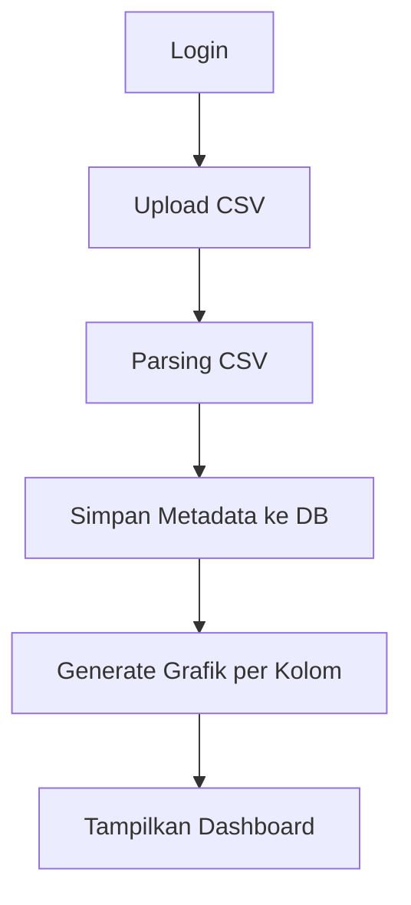

# 📊 ViewData

**Upload CSV → Visualisasi Grafik → Simpan ke Database (per User & File)**

---

## 🔎 Deskripsi Singkat

**ViewData** adalah aplikasi web berbasis **Python (Flask)** yang digunakan untuk:
- Login user menggunakan **username & password**
- Upload file **CSV**
- Menampilkan **grafik otomatis** untuk setiap kolom numerik
- Menyimpan data upload ke **database SQLite** berdasarkan **username** dan **nama file**
- Menjalankan aplikasi menggunakan **Docker Compose**
- Menggunakan **Tailwind CSS** untuk frontend
- Backend berjalan pada **port 5001**

Aplikasi ini cocok untuk:
- Data exploration sederhana  
- Dashboard internal  
- Testing visualisasi data CSV  

---

## 🧱 Tech Stack

| Layer      | Teknologi |
|-----------|-----------|
| Backend   | Python (Flask) |
| Database  | SQLite |
| Frontend | HTML + Tailwind CSS |
| Chart    | Chart.js |
| Auth     | Session-based Login |
| Container| Docker & Docker Compose |

---

## 📁 Struktur Project

```text
viewdata/
│
├── app/
│   ├── __init__.py
│   ├── app.py              # Entry point Flask
│   ├── models.py           # Database schema & koneksi
│   ├── routes.py           # Routing utama aplikasi
│   ├── auth.py             # Login & authentication
│   ├── utils.py            # CSV parsing & helper
│   │
│   ├── templates/
│   │   ├── login.html      # Halaman login
│   │   ├── upload.html     # Halaman upload CSV
│   │   └── dashboard.html  # Halaman grafik
│   │
│   └── static/
│       └── css/
│           └── tailwind.css
│
├── data/
│   └── uploads/            # Penyimpanan file CSV
│
├── docker-compose.yml
├── Dockerfile
├── requirements.txt
├── README.md
└── AGENTS.md
```

---

## 🔐 Default User

| Field    | Value      |
|----------|------------|
| Username | admin      |
| Password | admin123   |

---

## 🔄 Alur Aplikasi



**Flow dalam bentuk teks:**
1. Login dengan credentials
2. Upload file CSV
3. Parsing data CSV
4. Simpan metadata ke database
5. Generate grafik untuk setiap kolom numerik
6. Tampilkan di dashboard dengan chart.js

---

## 🗄️ Database Schema (SQLite)

### Table: `users`
| Column        | Type    | Constraints |
|---------------|---------|-------------|
| id            | INTEGER | PRIMARY KEY |
| username      | TEXT    | UNIQUE, NOT NULL |
| password_hash | TEXT    | NOT NULL |

### Table: `upload`
| Column       | Type     | Constraints |
|--------------|----------|-------------|
| id           | INTEGER  | PRIMARY KEY |
| filename     | TEXT     | NOT NULL |
| filepath     | TEXT     | NOT NULL |
| uploaded_at  | DATETIME | DEFAULT NOW |
| user_id      | INTEGER  | FOREIGN KEY → users(id) |

---

## 🚀 Cara Menjalankan

### Menggunakan Docker Compose (Recommended)

```bash
# Build dan jalankan container
docker compose up -d

# Akses aplikasi
open http://localhost:5001
```

### Menjalankan Manual

```bash
# Install dependencies
pip install -r requirements.txt

# Jalankan aplikasi
python run.py
```

---

## ✨ Fitur Utama

- ✅ **Modern UI** - Glassmorphism design dengan dark mode
- ✅ **Auto Visualization** - Otomatis generate chart untuk kolom numerik
- ✅ **Multi-file Management** - Kelola multiple CSV files
- ✅ **Responsive Design** - Mobile-friendly interface
- ✅ **Dark Mode** - Toggle light/dark theme
- ✅ **Data Statistics** - Min, Max, Average untuk setiap kolom

---

## 📝 Catatan

- File CSV akan disimpan di folder `data/uploads/`
- Database SQLite tersimpan di `instance/app.db`
- Setiap user memiliki file terpisah
- Chart menggunakan Chart.js dengan gradient modern
